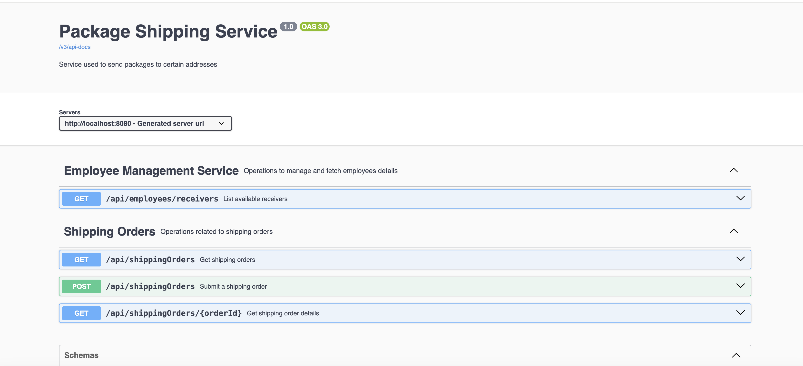

# Abn Amro Package Shipping Service
The **Package Shipping Service** is used to submit shipping order and ship package to employee address.  
It has the following features:

- Tracks status of packages.
- Order the shipping of a Package.
- Display Shipping Details.

# Tech Stack
- Java 17
- Spring Boot
- H2 database
- Documented with Swagger
- Unit Tests
- Integration Tests
- Logging
- Exception Handling

# Running the Application

This is a step-by-step guide how to build and run the project using Docker.

- First you need to install dependencies by running clean and install maven commands.
- Once you run the server you can access the project at port 8080.
- You can see API documentation http://localhost:8080/swagger-ui/index.html?configUrl=/v3/api-docs
- I have hardcoded the details of four employees, and need to use them for submitting the order.

# Swagger API Documentation

- You can see API documentation http://localhost:8080/swagger-ui/index.html?configUrl=/v3/api-docs
_

# Improvements

### Improvements for the Architecture

#### 1. **Service Discovery & Load Balancing**
- Implement a service discovery mechanism to automatically manage service instances and their communication. Tools such as Eureka, or Kubernetes services can be used to facilitate dynamic service discovery and load balancing.

#### 2. **Database Scalability**
- **Current Limitation:** A database can become a bottleneck in terms of performance and scalability as the application load increases. For dev implmented with H2SQL, it should need to integrated with stable sql infrastructure for other env.
- **Proposed Improvement:** Consider adopting a database per service pattern or integrating read replicas to distribute the database load. Additionally, using a more scalable database solution or services in cloud also we can consider.

#### 3. **Enhanced Security Practices**
- **Current Limitation:** The current architecture may require enhanced security measures.
- **Proposed Improvement:** Implement API gateways with OAuth2 for secure API access, and use HTTPS for all internal communication. Additionally, consider data encryption at rest and in transit to further secure sensitive user data.

#### 4. **Data Caching and Indexing**
- **Current Limitation:** Repeated queries for popular data can put unnecessary load on the database, affecting performance.
- **Proposed Improvement:** Implement caching mechanisms using Redis or Memcached at the service level to cache frequent queries and reduce database load, thereby improving response times for end-users.

#### 5. **Asynchronous Processing Improvements**
- **Proposed Improvement:** Implement message queue or kafka for the asynchronous processing with **Package order Service**. Study the possibility for the use in other scenarios.

#### 6. **Monitoring and Logging**
- **Current Limitation:** Monitoring and logging are very important for maintaining system health and for quick troubleshooting of issues in microservices architectures.
- **Proposed Improvement:** We could integrate a centralized logging solution and implement a monitoring solution like Prometheus and Grafana to gain real-time insights into the system's health and performance.

#### 7. **Continuous Integration/Continuous Deployment (CI/CD)**
- **Current Limitation:** Manual deployments can be error-prone and are not scalable for frequent updates.
- **Proposed Improvement:** Set up CI/CD pipelines using Jenkins, GitHub Actions, or GitLab CI to automate testing and deployment processes. This ensures that the code is reliably built, tested, and deployed to production environments.

#### 8. **Secure Management of Sensitive Credentials**
- **Current Limitation:** Sensitive credentials for the database are exposed in th file, posing a security risk.
- **Proposed Improvement:** Move sensitive configuration outside of the code base. Utilize a secure configuration server like Spring Cloud Config for managing credentials and configurations securely, especially in a production environment.

### Conclusion
By addressing these potential improvements, the architecture will not only maintain its current efficiency and robustness but will also enhance its scalability, security, and maintainability. These enhancements will prepare the system to handle growing user demands and future feature expansions more effectively.

Footer
© 2022 GitHub, Inc.
Footer navigation
Terms
Privacy
Security
Status
Docs
Contact GitHub
Pricing
API
Training
Blog
About